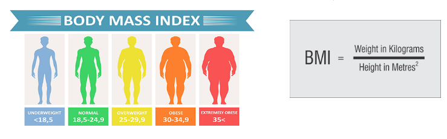
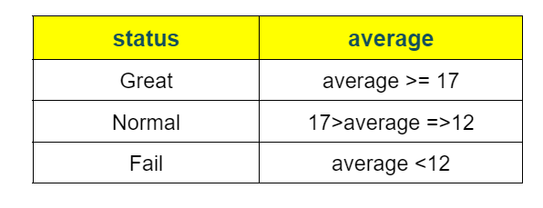

## Learning goals:
  * Getting input from the user
  * Use operators
  * Use if and while
  
## Exercise programs:

### Calculator.py

A simple calculator program (converting radians to degrees for trigonometric functions)

-------------------------------------------------------------------------

### Valid_TriangleSides.py:

Write a program that receives the size of three sides of a triangle and determines whether it is possible to draw such a triangle or not? 
(Hint: in mathematics, it is a theorem that states that in any triangle, the size of each side is smaller than the sum of the sizes of the other two sides)

--------------------------------------------------------------------------

### BMI.py 

Write a program that calculates the BMI index for that person by receiving the person's weight (kilograms) and height (meters) 
and prints an appropriate message about the person's body mass based on the values in the figure below:

--------------------------------------------------------------------------

### Student_status.py

Write a program that receives a student's first and last name and the grades of three subjects and 
prints the student's academic status in the output after calculating the grade point average (normal - excellent - conditional)

