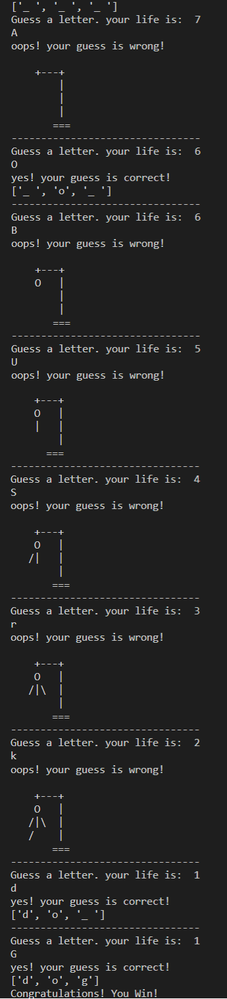

  ### Learning goals:
  * Random selection from a list
  * Management of uppercase and lowercase letters
  * Find letters and their position in a string
  * Non-repeating random numbers
  * Sorting a list
-----------------------------------------------------------------------------  

## Exercise programs:

### hangman.py

Implement the HangMan game:
Solve the problem of entering uppercase characters. (For example, if the desired word is book and the user enters the capital letter B, it will be accepted from him)

Example:

--------------------------------------------------------

### random_numbers_without_duplicates.py

Fill an array of length n with non-repeating random numbers.  
Example: [2, 3, 6, 1, 0, 14, 16, 7]

----------------------------------------------------------

### sort_list.py

Write a program that receives an array from the user and then checks whether the values of the array are sorted from small to large.  
For example, the array [1,2,4,6,7] is sorted. But the array [8,5,4,1,6,7] is not sorted.

------------------------------------------------------------

### snake_length.py

Write a program that receives the number n from the user. Then draw a striped snake of length n.  
For example:  
n = 9  
*#*#*#*#*  

