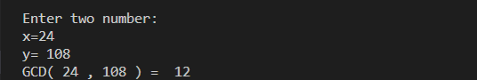

### Learning goals:
* use functions
* changing the color of print texts
* use enumerate
________________________________________________

## Exercise programs:

### 1.checkerBoard.py
Write a function that reciveing m and n as parameters, prints a checkerboard with n x m dimensions.

Example output:

_______________________________________________

### 2.quadratic_equation.py
Solving the quadratic equation. <a href="" > Tips </a>

Example output:

__________________________________________________

### 3.Multiplication_table.py
Write a function that receiveing m and n as parameters, prints multiplication table with m x n dimensions.

Example output:

_____________________________________________________
     
### 4.count_words.py
Write a function that receives a statement from the user and counts the number of words. Example:
input: python is a powerful programming language             
output: 6

Example output:

_________________________________________________________

### 5.check_factorial.py
Write a program that receive a number from the user and determine that is factorial this number or not. 
if number is factorial, print "Yes" in output, otherwise print "No". Example:
input: 24       output: "Yes"
because we know 24 = 4! = 4x332x1 

Example output:

___________________________________________________________

### 6.gcd_calculate.py
Write a program that receives two numbers from the user and calculates greatest common divisor of these numbers. (using a for loop)

Example output:

________________________________________________________

### 7.lcm_calculate.py
Write a program that receives two numbers from the user and calculates least common multiple of these numbers. (using a for loop) 

Example output:

_____________________________________________________________

### 8.pyfiglet_test.py
The Pyfiglet module is a Python module that comes with many functions, and we can use these functions in a Python program to create fancy texts with large fonts & sizes in the output. 

Example output:

