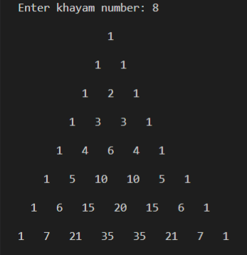
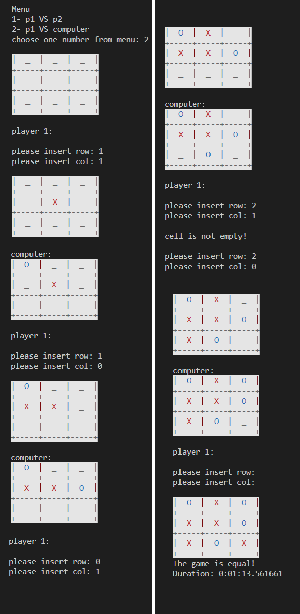
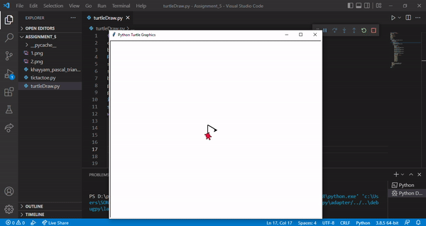

### Learning goals:
* More practice with arrays and functions
* Use colorama Lib and change Text and background color in terminal
* Use Timer and calculate duration
* Turtle Lib

---------------------------------------------------------------------------

## Excercise programs:

### 1. khayyam_pascal_triangle.py

Get the n number from the user and calculate khayyam pascal's triangle up to the n line. Then store it in an array and print the result.

Example output:

-----------------------------------------------------------------------------

### 2.tictactoe.py
implement the tictactoe Game with this properties:
+ have win and equals conditionals for players
+ the user can be select from menu: play Vs computer or other player
+ show each player with deference color
+ print duration play time after end the game

Example output:

__________________________________________________________________________

### 3.turtleDraw.py

Example output:

