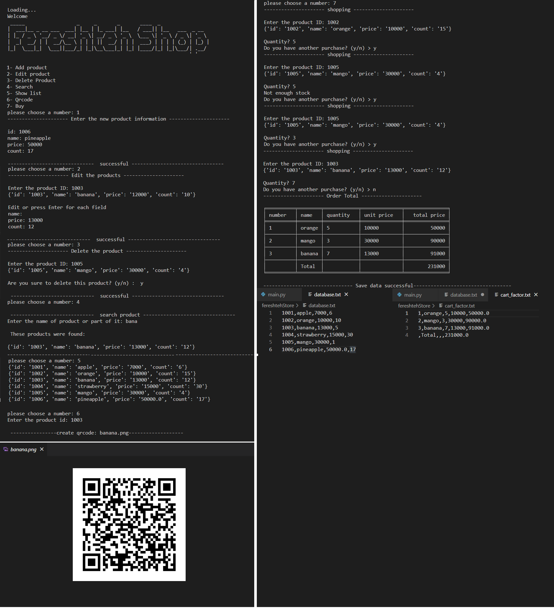

### Learning goals:
* List
* Dictionary
* File
* Qrcode
________________________________________________

## Exercise program:

### 1.main.py
Create an online store with the following features:

* Add new product
* Edit product
* Product removal
* Search by name
* show products list
* Write a function to receive the product code, then store the product information as a Qr Code. (Refer to @pylearn Instagram address for guidance)
* shopping from store:
  A) First, the product code is received.
  b) Then if the product did not exist. The appropriate message is printed. If there were products; The desired number is asked from the user.
  c) if the warehouse stock was not enough; The appropriate message is printed. If there was enough inventory; It is deducted from the stock and added to the user's shopping cart.
  t) This process continues until the user wants to buy a new product.
  e) after completing the purchase; An invoice is printed that includes the price of each product and the total price.
  Save information to file when exiting the program

Example output:

