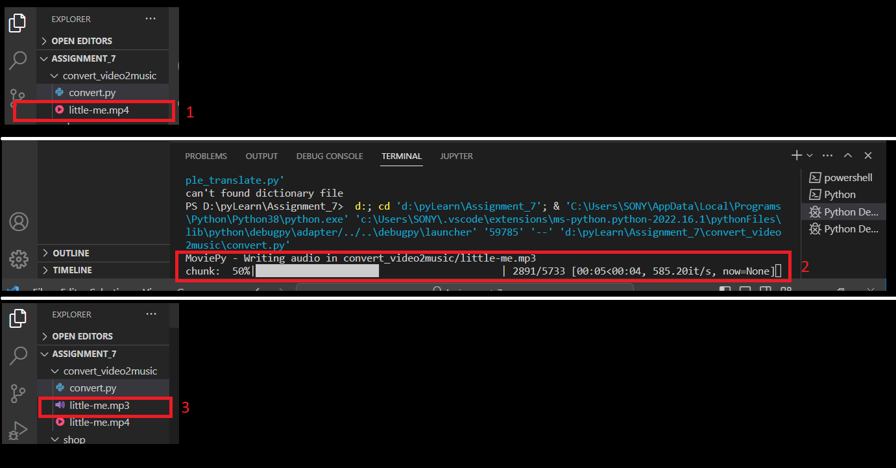
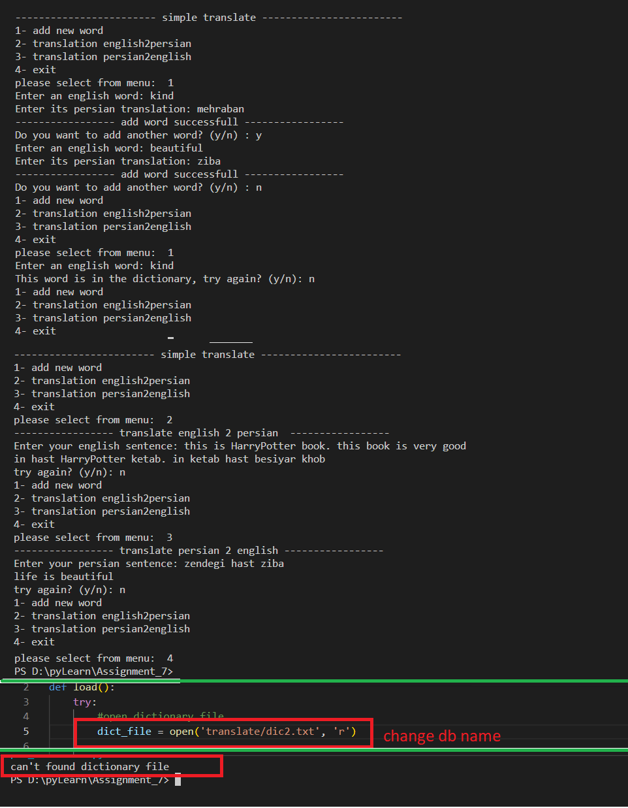

### Learning goals:
* more practice wih lists, dictionaries and Files
* moviepy
* try - except
________________________________________________

## Exercise program:

### online shop
Optimizing the online shop of the last lesson

In the previous online shop project, after each operation, the changes were saved in the file. 
This work slows down the program because the external memory (hard) is called every time. 
In this session, the codes have been rewritten in a more optimal way. 
During the whole period of working with the program, the information is processed in the CPU and 
recorded in the main memory (RAM) and finally when the user exits the program, all the changes 
made in the list are saved in the file (side memory).
__________________________________________________________________________

### convert mp4 to mp3
Convert a music video to a music with moviepy

Example output:

__________________________________________________________________________

### translator
Design a translator program (similar to Google Translate).
First, open the word database file and save its information in a list of dictionaries as follows:

Add the following features to the program:
Menu design with four options
+ add new word 
+ translation english2persian 
+ translation persian2english 
+ exit

#### English to Persian translation
for example:
input: this is Harry Potter book
output: in hast HarryPotter ketab

#### Persian to English translation
Add a new word to the word bank file

note: The user input string can be more than one sentence. Sentences are separated by point.
If the word bank file did not exist in the desired path. The program will display the appropriate message.

Example output:

